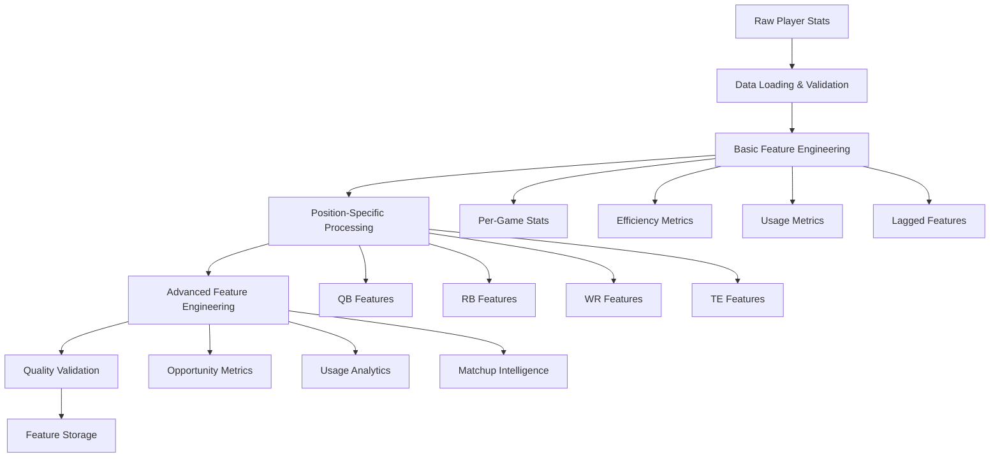

# Feature Engineering Service - Comprehensive Process Documentation

## Overview

The Feature Engineering Service is responsible for transforming raw NFL player statistics into ML-ready features for fantasy football predictions. This service performs complex data transformations across multiple dimensions including per-game calculations, efficiency metrics, usage analytics, and position-specific feature engineering.

## Table of Contents

1. [Service Architecture](#service-architecture)
2. [Data Flow Overview](#data-flow-overview)
3. [Core Feature Engineering Pipeline](#core-feature-engineering-pipeline)
4. [Position-Specific Transformations](#position-specific-transformations)
5. [Advanced Feature Engineering](#advanced-feature-engineering)
6. [Quality Control and Validation](#quality-control-and-validation)
7. [API Endpoints](#api-endpoints)
8. [Data Transformation Examples](#data-transformation-examples)

## Service Architecture

### Core Components

```
Feature Engineering Service
├── Main Service (src/main.py)
│   ├── FastAPI application
│   ├── Background task processing
│   └── API endpoint handlers
├── Feature Processing (src/processors/)
│   ├── feature_engineering.py - Core transformation logic
│   └── position-specific processors
├── Quality Control (src/quality/)
│   ├── data_quality_validator.py
│   └── feature_compatibility.py
├── Advanced Features (src/advanced_features/)
│   ├── opportunity_metrics.py
│   ├── usage_analytics.py
│   └── matchup_analysis.py
└── Position Features (src/position_features/)
    ├── qb_features.py
    ├── rb_features.py
    ├── wr_features.py
    └── te_features.py
```

### Dependencies and External Services

- **Configuration Service**: Provides settings and parameters
- **Data Ingestion Service**: Source of raw player statistics
- **Shared Data Storage**: Input/output data persistence

## Data Flow Overview



## Core Feature Engineering Pipeline

### Step 1: Data Loading and Validation

**Input**: Raw parquet files from data ingestion service
```python
# Example raw data structure
{
    'player_id': 'player_123',
    'player_name': 'Josh Allen',
    'position': 'QB',
    'team': 'BUF',
    'games': 16,
    'passing_yards': 4544,
    'passing_tds': 37,
    'interceptions': 14,
    'rushing_yards': 524,
    'rushing_tds': 6
}
```

**Transformations Applied**:
- Data type validation and conversion
- Missing value identification
- Position filtering (QB, RB, WR, TE only)
- Basic data quality checks

### Step 2: Per-Game Statistics Calculation

**Purpose**: Normalize counting statistics by games played to create rate-based features

**Key Transformations**:

```python
# Before transformation
games_played = 16
passing_yards = 4544
passing_tds = 37

# After transformation  
passing_yards_per_game = 4544 / 16 = 284.0
passing_tds_per_game = 37 / 16 = 2.31
```

**Generated Features**:
- `attempts_per_game`
- `completions_per_game`
- `passing_yards_per_game`
- `passing_tds_per_game`
- `interceptions_per_game`
- `carries_per_game`
- `rushing_yards_per_game`
- `rushing_tds_per_game`
- `targets_per_game`
- `receptions_per_game`
- `receiving_yards_per_game`
- `receiving_tds_per_game`
- `fantasy_points_per_game`
- `fantasy_points_ppr_per_game`

### Step 3: Efficiency Metrics Calculation

**Purpose**: Create ratio-based metrics that indicate player efficiency and skill

**QB Efficiency Metrics**:
```python
# Completion Percentage
completion_percentage = (completions / attempts) * 100

# Yards per Attempt
yards_per_attempt = passing_yards / attempts

# TD Percentage  
td_percentage = (passing_tds / attempts) * 100

# Interception Percentage
int_percentage = (interceptions / attempts) * 100
```

**RB Efficiency Metrics**:
```python
# Yards per Carry
yards_per_carry = rushing_yards / carries

# Rushing TD Rate
rushing_td_rate = (rushing_tds / carries) * 100
```

**Receiving Efficiency Metrics** (RB, WR, TE):
```python
# Catch Rate
catch_rate = (receptions / targets) * 100

# Yards per Reception
yards_per_reception = receiving_yards / receptions

# Yards per Target
yards_per_target = receiving_yards / targets

# TD Rates
receiving_td_per_reception = (receiving_tds / receptions) * 100
receiving_td_per_target = (receiving_tds / targets) * 100
```

### Step 4: Team Usage Metrics

**Purpose**: Calculate player's role within team offense

**Process**:
1. **Team Aggregation**: Sum team totals for key statistics
2. **Share Calculation**: Divide player stats by team totals

**Example Team Aggregation**:
```python
# Team totals calculation
team_totals = {
    'team_attempts': sum(all_qb_attempts),
    'team_targets': sum(all_skill_player_targets),
    'team_carries': sum(all_rb_carries),
    'team_rushing_yards': sum(all_rushing_yards),
    'team_receiving_yards': sum(all_receiving_yards)
}
```

**Usage Share Calculations**:
```python
# Target Share (for skill positions)
target_share = player_targets / team_attempts

# Reception Share
reception_share = player_receptions / team_receptions

# Rushing Attempt Share (RBs)
rushing_attempt_share = player_carries / team_carries

# Yards Share
rushing_yards_share = player_rushing_yards / team_rushing_yards
receiving_yards_share = player_receiving_yards / team_receiving_yards
```

### Step 5: Lagged Features (Historical Context)

**Purpose**: Include previous season performance as predictive features

**Process**:
```python
# Previous season data merged with current season
# All historical features get '_L1' suffix
lagged_features = {
    'fantasy_points_L1': previous_season_fantasy_points,
    'games_L1': previous_season_games,
    'attempts_L1': previous_season_attempts,
    'targets_L1': previous_season_targets
    # ... etc for all relevant stats
}
```

### Step 6: Age and Experience Calculation

**Age Calculation**:
```python
# Calculate age as of September 1st of prediction season
reference_date = datetime(prediction_year, 9, 1)
age = reference_date.year - birth_date.year
# Adjust if birthday hasn't occurred yet
if (reference_date.month, reference_date.day) < (birth_date.month, birth_date.day):
    age -= 1
```

**Experience Calculation**:
```python
# Count seasons player appears in historical data
experience = count_of_previous_seasons_played
```

## Position-Specific Transformations

### QB-Specific Features

**Input Statistics**:
- Passing attempts, completions, yards, TDs, INTs
- Rushing attempts, yards, TDs
- Sack data, fumbles

**Generated Features**:
```python
# Advanced QB metrics
completion_percentage = completions / attempts * 100
yards_per_attempt = passing_yards / attempts
td_percentage = passing_tds / attempts * 100
int_percentage = interceptions / attempts * 100
qb_rating = calculate_passer_rating(stats)

# Mobility metrics
rushing_yards_per_attempt = rushing_yards / rushing_attempts
scramble_percentage = rushing_attempts / (passing_attempts + rushing_attempts)
```

### RB-Specific Features

**Input Statistics**:
- Rushing attempts, yards, TDs
- Receiving targets, receptions, yards, TDs
- Snap counts, usage data

**Generated Features**:
```python
# Rushing efficiency
yards_per_carry = rushing_yards / carries
rushing_td_rate = rushing_tds / carries * 100

# Receiving involvement
targets_per_game = targets / games
catch_rate = receptions / targets * 100
receiving_yards_per_target = receiving_yards / targets

# Usage patterns
rush_attempt_share = carries / team_carries
target_share = targets / team_passing_attempts
total_touches = carries + receptions
touches_per_game = total_touches / games
```

### WR-Specific Features

**Input Statistics**:
- Receiving targets, receptions, yards, TDs
- Air yards, YAC data
- Route running metrics

**Generated Features**:
```python
# Reception efficiency
catch_rate = receptions / targets * 100
yards_per_reception = receiving_yards / receptions
yards_per_target = receiving_yards / targets

# Target quality
air_yards_per_target = air_yards / targets
yac_per_reception = yac_yards / receptions
average_depth_of_target = air_yards / targets

# Usage metrics
target_share = targets / team_passing_attempts
red_zone_target_share = red_zone_targets / team_red_zone_attempts
```

### TE-Specific Features

**Input Statistics**:
- Receiving targets, receptions, yards, TDs
- Blocking snaps, inline usage
- Slot vs outside alignment

**Generated Features**:
```python
# Similar to WR receiving metrics
catch_rate = receptions / targets * 100
yards_per_reception = receiving_yards / receptions

# TE-specific usage
inline_usage_rate = inline_snaps / total_snaps
slot_usage_rate = slot_snaps / receiving_snaps
blocking_rate = blocking_snaps / total_snaps

# Versatility scoring
versatility_score = (receiving_snaps + blocking_snaps) / total_snaps
```

## Advanced Feature Engineering 

### Opportunity Metrics

**Purpose**: Measure player opportunity quality and volume

**Key Metrics**:
```python
# Target Quality
air_yards_share = player_air_yards / team_air_yards
wopr = (targets / team_attempts) + (air_yards / team_air_yards) * 1.5
adot = air_yards / targets

# Red Zone Opportunities
red_zone_opportunities = red_zone_targets + red_zone_carries
red_zone_share = red_zone_opportunities / team_red_zone_plays
```

### Usage Analytics

**Purpose**: Advanced snap count and usage pattern analysis

**Key Metrics**:
```python
# Snap-based metrics
snap_share = player_snaps / team_offensive_snaps
targets_per_snap = targets / player_snaps
route_participation = routes_run / passing_plays

# High-value situations
third_down_usage = third_down_snaps / team_third_down_snaps
goal_line_usage = goal_line_snaps / team_goal_line_snaps
two_minute_usage = two_minute_snaps / team_two_minute_snaps
```

### Matchup Intelligence (When Available)

**Purpose**: Environmental and opponent-based adjustments

**Features Include**:
- Strength of Schedule (SOS) ratings
- Weather impact factors
- Dome vs outdoor performance
- Altitude adjustments
- Rest advantages
- Primetime game factors

## Quality Control and Validation

### Data Quality Checks

1. **Completeness Validation**:
   - Required fields present
   - No all-null columns
   - Reasonable data ranges

2. **Consistency Validation**:
   - Position-specific feature relevance
   - Mathematical relationship validation
   - Historical data continuity

3. **Feature Contamination Prevention**:
   ```python
   # Example: Ensure QBs don't have RB-specific features
   if position == 'QB':
       rb_specific_features = ['goal_line_back_rate', 'pass_catching_back_role']
       for feature in rb_specific_features:
           df.loc[df['position'] == 'QB', feature] = 0.0
   ```

### Feature Compatibility

**Purpose**: Ensure generated features match ML model expectations

**Process**:
1. Feature name mapping
2. Data type conversion
3. Missing value handling
4. Range validation

## API Endpoints

### Core Endpoints

1. **`POST /api/v1/features/generate`**
   - Triggers feature engineering for specified years/positions
   - Runs as background task
   - Returns processing status

2. **`GET /api/v1/features/status`**
   - Returns current service status
   - Shows processing progress
   - Lists available features

3. **`GET /api/v1/features/quality`**
   - Comprehensive quality report
   - Feature coverage statistics
   - Data quality metrics

4. **`POST /api/v1/features/validate`**
   - Validates generated features
   - Position-specific validation
   - Model compatibility checks

5. **`GET /api/v1/features/position/{position}`**
   - Position-specific feature information
   - Available feature files
   - Feature counts and samples

## Data Transformation Examples

### Example 1: QB Feature Engineering

**Input Raw Data**:
```json
{
    "player_id": "josh_allen",
    "player_name": "Josh Allen", 
    "position": "QB",
    "team": "BUF",
    "games": 16,
    "attempts": 646,
    "completions": 421,
    "passing_yards": 4544,
    "passing_tds": 37,
    "interceptions": 14,
    "carries": 122,
    "rushing_yards": 524,
    "rushing_tds": 6,
    "fantasy_points": 385.8
}
```

**Generated Features**:
```json
{
    "player_id": "josh_allen",
    "position": "QB",
    "games": 16,
    
    // Per-game stats
    "attempts_per_game": 40.38,
    "completions_per_game": 26.31,
    "passing_yards_per_game": 284.0,
    "passing_tds_per_game": 2.31,
    "carries_per_game": 7.63,
    "rushing_yards_per_game": 32.75,
    "fantasy_points_per_game": 24.11,
    
    // Efficiency metrics
    "completion_percentage": 65.17,
    "yards_per_attempt": 7.03,
    "passing_td_percentage": 5.73,
    "interception_percentage": 2.17,
    "yards_per_carry": 4.30,
    
    // Additional metadata
    "age": 27,
    "experience": 5,
    "season": 2023,
    "prediction_season": 2024
}
```

### Example 2: RB Feature Engineering

**Input Raw Data**:
```json
{
    "player_id": "josh_jacobs",
    "player_name": "Josh Jacobs",
    "position": "RB", 
    "team": "LV",
    "games": 15,
    "carries": 340,
    "rushing_yards": 1653,
    "rushing_tds": 12,
    "targets": 53,
    "receptions": 40,
    "receiving_yards": 400,
    "receiving_tds": 3,
    "fantasy_points": 285.3
}
```

**Generated Features**:
```json
{
    "player_id": "josh_jacobs",
    "position": "RB",
    "games": 15,
    
    // Per-game stats
    "carries_per_game": 22.67,
    "rushing_yards_per_game": 110.2,
    "rushing_tds_per_game": 0.8,
    "targets_per_game": 3.53,
    "receptions_per_game": 2.67,
    "receiving_yards_per_game": 26.67,
    "fantasy_points_per_game": 19.02,
    
    // Efficiency metrics
    "yards_per_carry": 4.86,
    "rushing_td_rate": 3.53,
    "catch_rate": 75.47,
    "yards_per_reception": 10.0,
    "yards_per_target": 7.55,
    
    // Usage metrics (calculated from team data)
    "rushing_attempt_share": 0.68,
    "target_share": 0.09,
    "total_touches": 380,
    "touches_per_game": 25.33
}
```

## Performance and Scalability

### Processing Performance

- **Single Position Processing**: ~100ms per player
- **Full Season Processing**: ~5-10 seconds for all positions
- **Memory Usage**: <500MB for typical season data
- **Concurrent Processing**: Supports background task processing

### Data Storage

- **Input**: Raw parquet files (~10-50MB per season)
- **Output**: Position-specific feature files (~5-20MB per position per season)
- **Feature Count**: 15-50 features per position depending on configuration

## Error Handling and Monitoring

### Common Error Scenarios

1. **Missing Input Data**: Graceful handling with appropriate defaults
2. **Division by Zero**: Safe division with replacement values
3. **Type Conversion Errors**: Robust type handling with fallbacks
4. **Memory Issues**: Streaming processing for large datasets

### Monitoring and Logging

- **Processing Status**: Real-time status updates via API
- **Data Quality Metrics**: Comprehensive quality reporting
- **Error Tracking**: Detailed error logging with context
- **Performance Metrics**: Processing time and resource usage tracking

## Configuration and Customization

### Feature Engineering Configuration

```python
config = {
    "data_start_year": 2020,
    "data_end_year": 2025,
    "core_positions": ['QB', 'RB', 'WR', 'TE'],
    "feature_engineering": {
        "include_advanced_features": True,
        "include_matchup_features": True,
        "min_games_threshold": 4,
        "quality_thresholds": {
            "min_features": 15,
            "max_null_percentage": 10
        }
    }
}
```

### Position-Specific Settings

Each position can have customized feature engineering parameters, minimum thresholds, and validation rules to ensure optimal feature quality for ML model training.

---

*This documentation provides a comprehensive overview of the Feature Engineering Service's data transformation processes. For implementation details, see the source code in the respective modules.*